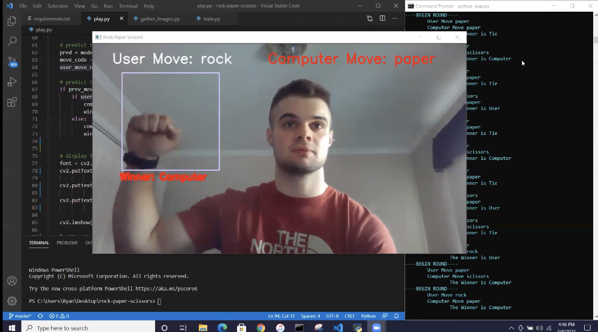

## NEURAL-NETWORK-ROCK-PAPER-SCISSORS
Trains a neural network with images of my hand to build a model for classifying hand gesture as 'rock', 'paper' or 'scissors'.
COntains script that loads model and allows user to play Rock Paper Scissors against the CPU.

## Built With
- Python
- Tensorflow
- Keras
- OpenCV
    
## Project Results

